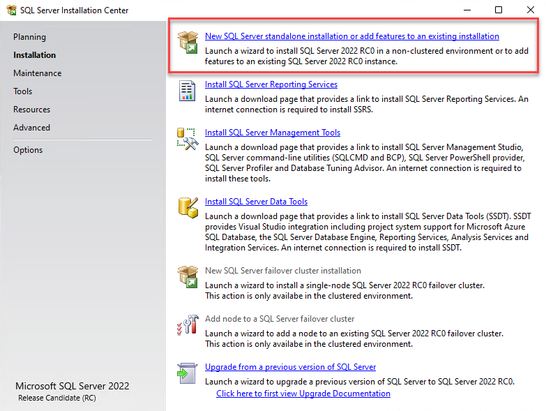

<style>
.reveal section img { background:none; border:none; box-shadow:none; }
</style>

## Data Virtualization with PolyBase

<a href="https://www.catallaxyservices.com">Kevin Feasel</a> (<a href="https://twitter.com/feaselkl">@feaselkl</a>)<br />
<a href="https://csmore.info/on/zdt">https://CSmore.info/on/polybase</a>

---

@title[Who Am I?]

@snap[west splitscreen]
<table>
	<tr>
		<td><a href="https://csmore.info"></a></td>
		<td><a href="https://csmore.info">Catallaxy Services</a></td>
	</tr>
	<tr>
		<td><a href="https://curatedsql.com"></a></td>
		<td><a href="https://curatedsql.com">Curated SQL</a></td>
	</tr>
	<tr>
		<td><a href="https://wespeaklinux.com"></a></td>
		<td><a href="https://wespeaklinux.com">We Speak Linux</a></td>
	</tr>
</table>
@snapend

@snap[east splitscreen]
<div>
	<a href="https://www.twitter.com/feaselkl"></a>
	<br />
	<a href="https://www.twitter.com/feaselkl">@feaselkl</a>
</div>
@snapend

---?image=presentation/assets/background/motivation.jpg&size=cover&opacity=20

### Motivation

The goal of this talk is to cover PolyBase, Microsoft's technology for data virtualization and query scale-out.

We will look at installation, configuration, and a number of practical business scenarios involving the product.

---

@title[What is PolyBase?]

## Agenda

1. **What is PolyBase?**
2. Installation + Configuration
3. The Building Blocks
4. Cold Storage
5. ELT
6. Data Virtualization
7. Tuning and Administration

---

### What is PolyBase?

PolyBase is Microsoft's newest technology for covering three use cases:

1. Connecting to heterogeneous, remote data sources.
2. Data virtualization:  creating the appearance of local data while still having the data live remotely.
3. Scale-out versus scale-up and Massively Parallel Processing (MPP).

---

### A Brief History

* Parallel Data Warehouse (2012):  PolyBase introduced as a way to integrate SQL Server and Hadoop.
* SQL Server 2016:  PolyBase "V1" introduced.
* SQL Server 2019:  PolyBase "V2" introduced.  PolyBase also brought into SQL Server Big Data Clusters.

---

### Supported Data Sources:  V1

PolyBase V1 supported two external data sources:

1. HDFS -- Hadoop
2. WASB(S) -- Blob Storage

---

### Supported Data Sources:  V2

PolyBase V2 has blown open the door in supported data sources:

1. SQL Server
2. Oracle
3. MongoDB / Cosmos DB
4. Teradata
5. Any ODBC connector -- Hive, Spark, Excel

---

### Massively Parallel Processing

SQL Server is a classic "scale-up" technology:  if you want more power, add more RAM/CPUs/resources to the single server.

Hadoop is a great example of an MPP system:  if you want more power, add more servers; the system will coordinate processing.

---

### MPP and Scale-Out Versus Scale-Up

Upsides:
* Scale-out is often cheaper than scale-up
* You hit the ceiling on scale-up long before scale-out

Downsides:
* Scale-out is typically more complex
* Scale-out has a longer startup time

---

@title[Installation and Configuration]

## Agenda

1. What is PolyBase?
2. **Installation + Configuration**
3. The Building Blocks
4. Cold Storage
5. ELT
6. Data Virtualization
7. Tuning and Administration

---



---


---


---


---


---


---

 <!-- .element height="50%" width="50%" -->

---


---

### Enabling PolyBase

```sql
USE [master]
GO
EXEC sp_configure
	@configname = 'polybase enabled',
	@configvalue = 1;
GO
RECONFIGURE;
GO
EXEC sp_configure
	@configname = 'hadoop connectivity',
	@configvalue = 7;
GO
RECONFIGURE
GO
```

---

### Driver Installation

In order to use the generic ODBC connector, you need to install an appropriate ODBC driver on the machine hosting SQL Server.  Grab the right driver and follow the normal install steps.

We will demonstrate with Apache Hive and Apache Spark, both for Hortonworks Data Platform (HDP) 3.0.

---


---


---


---


---


---

@title[The Building Blocks]

## Agenda

1. What is PolyBase?
2. Installation + Configuration
3. **The Building Blocks**
4. Cold Storage
5. ELT
6. Data Virtualization
7. Tuning and Administration

---

### External Objects

Three sorts of external objects exist.

1. External Data Source
2. External File Format
3. External Table

---

### External Data Source

An external data source tells SQL Server where it can find remote data.

That data does **not** migrate to SQL Server!  It lives on the external data source.

---

```sql
CREATE EXTERNAL DATA SOURCE Clusterino WITH
(
	TYPE = HADOOP,
	LOCATION = 'hdfs://clusterino:8020',
	RESOURCE_MANAGER_LOCATION = N'clusterino:8050'
);
```

@[1](Name the external data source something memorable.)
@[3](Use HADOOP for Hadoop and Blob Storage.)
@[4](The location is the host and port for HDFS.)
@[5](The resource manager is the host and port for YARN.)

---

```sql
CREATE DATABASE SCOPED CREDENTIAL SqlWin10Credentials
WITH IDENTITY = 'PolyBaseUser', Secret = '<<Some Password>>';
GO
CREATE EXTERNAL DATA SOURCE SQLWIN10 WITH
(
	LOCATION = 'sqlserver://SQLWIN10',
	PUSHDOWN = ON,
	CREDENTIAL = SqlWin10Credentials
);
```

@[1-2](PolyBase currently only supports SQL authentication.)
@[4-9](SQL Server external data source.)
@[6](Reference the remote SQL Server by hostname or IP address.)
@[7](Define whether pushdown is enabled or disabled.)
@[8](Use specific SQL authentication credentials.)

---

```sql
CREATE DATABASE SCOPED CREDENTIAL SparkCredential
WITH IDENTITY = '<Your Username>', Secret = '<Your Password>';
GO
CREATE EXTERNAL DATA SOURCE ClusterinoSpark WITH
(
	LOCATION = 'odbc://clusterino:10016',
	CONNECTION_OPTIONS = 'Driver={Hortonworks Spark ODBC Driver};
		Host = clusterino;
		Port = 10016;
		Database = default;
		ServerNode = clusterino:10016',
	CREDENTIAL = SparkCredential,
	PUSHDOWN = ON
);
```

@[1-2](PolyBase does not yet support Kerberos for Spark.)
@[4-14](Spark external data source.)
@[6](Use the generic ODBC interface.  Connect on Thrift port.)
@[7](This is an HDP cluster, so use the Hortonworks driver.)
@[8-10](Connection string still needs location details.)
@[11](ServerNode was necessary for HDP Spark.)
@[12](Use the credentials we created for Spark.)
@[13](Enable predicate pushdown.  This is optional.)

---

### External File Format

An external file format tells SQL Server what type of file you intend to use.  SQL Server supports delimited files (e.g., comma or tab separated), ORC, and Parquet formats.

This is **not** required for V2 data sources, as they do not read from files.

---

```sql
CREATE EXTERNAL FILE FORMAT CsvFileFormat WITH
(
	FORMAT_TYPE = DELIMITEDTEXT,
	FORMAT_OPTIONS
	(
		FIELD_TERMINATOR = N',',
		USE_TYPE_DEFAULT = True,
		STRING_DELIMITER = '"',
		ENCODING = 'UTF8'
	)
);
```

@[1](This isn't necessarily the best name...but it will do.)
@[3](Define this as a delimited text file.)
@[4-10](Delimited text has several format options.)
@[6](Field terminator separates columns.)
@[7](If True, use default type values; if False, use NULL.)
@[8](PolyBase removes string delimiters, but is kind of stupid about it.)
@[9](Encodings include UTF8 and UTF16.)

---

```sql
CREATE EXTERNAL FILE FORMAT OrcFileFormat WITH
(
	FORMAT_TYPE = ORC,
	DATA_COMPRESSION = 'org.apache.hadoop.io.compress.DefaultCodec'
);
```

@[3](ORC and Parquet are column-optimized formats, great for aggregating big data sets.)
@[4](ORC supports data ompression with default or Snappy codecs.)

---

### External Table

An external table tells SQL Server the structure of your external resource.  SQL Server requires **structured** data and will reject records which do not fit the data types and sizes you set.

---

```sql
CREATE EXTERNAL TABLE dbo.ParkingViolationsORC
(
	SummonsNumber VARCHAR(50),
	PlateID VARCHAR(120),
	RegistrationState VARCHAR(30),
	PlateType VARCHAR(50),
	IssueDate VARCHAR(50),
	...
)
WITH
(
	LOCATION = N'/PolyBaseData/NYCParkingTicketsORC/',
	DATA_SOURCE = Clusterino,
	FILE_FORMAT = OrcFileFormat,
	REJECT_TYPE = VALUE,
	REJECT_VALUE = 5000
);
```

@[1](Use the EXTERNAL syntax.)
@[1-9](Columns like a normal CREATE TABLE statement.)
@[10-17](PolyBase-specific columns.)
@[12](Specific folder/file in HDFS.)
@[13](Tie to an external data source.)
@[14](Specify a particular external file format.)
@[15-16](Determine rejection behavior.)

---

### Rejection and You

Going from unstructured to structured data is a risk:  conversions may fail.  When that happens, the PolyBase engine rejects that row.  After we meet a rejection threshold, PolyBase fails the query.

---

### Rejection and You

The three parameters we control are:

`REJECT_TYPE` : { `VALUE`, `PERCENTAGE` }
`REJECT_VALUE`
`REJECT_SAMPLE_VALUE` = Number of rows to pull in before recalculating rejection percentage.

---

### Rejection and You

Suppose `REJECT_TYPE = PERCENTAGE`, `REJECT_VALUE = 20`, and `REJECT_SAMPLE_VALUE = 5000`.

|Round|Rows|Failures|%|Result|
|-----|----|--------|-|------|
|1|5000|750|15%|Continue|
|2|5000|1100|18.5%|Continue|
|3|5000|1500|22.3%|Fail|

Percentage is **cumulative**, not per-batch.

---

```sql
CREATE EXTERNAL TABLE dbo.ParkingViolationsSQL
(
	SummonsNumber VARCHAR(50),
	PlateID VARCHAR(120),
	RegistrationState VARCHAR(30),
	PlateType VARCHAR(50),
	IssueDate VARCHAR(50),
	...
)
WITH
(
	LOCATION = 'Scratch.dbo.ParkingViolationsLocal',
	DATA_SOURCE = SQLCONTROL
);
```

@[1-9](Columns defined just like with Hadoop.)
@[3](Columns must be defined exactly as in the source.)
@[12](Location is a three-part name, specifying database, schema, and object.)
@[13](Data source is our external SQL Server.)
@[14](No rejection behavior is needed here.)

---

```sql
CREATE EXTERNAL TABLE dbo.NorthCarolinaPopulationTypedSpark
(
	SummaryLevel INT,
	CountyID INT,
	PlaceID INT,
	IsPrimaryGeography BIT,
	Name NVARCHAR(255),
	PopulationType NVARCHAR(255),
	Year INT,
	Population INT
)
WITH
(
	LOCATION = 'NorthCarolinaPopulationTyped',
	DATA_SOURCE = ClusterinoSpark
);
```

@[1-11](Remote Spark table defines structure here.)
@[14](Location is a Spark table or view.)
@[15](Data source is our Spark cluster.)
@[16](No rejection behavior is needed here.)

---?image=presentation/assets/background/demo.jpg&size=cover&opacity=20

### Demo Time

---

@title[Cold Storage]

## Agenda

1. What is PolyBase?
2. Installation + Configuration
3. The Building Blocks
4. **Cold Storage**
5. ELT
6. Data Virtualization
7. Tuning and Administration

---

### Cold Storage

Assumptions:
1. You have one or more giant tables in SQL Server.
2. Users only query a small, pre-known fraction of that data (e.g., last year or last 2 years).
3. Occasionally someone needs this under-utilized data.
4. When users do need the under-utilized data, they can afford to wait a while.

---

### Cold Storage

Technique:  write old data to Azure Blob Storage / Hadoop and use partitioned views to join back together.

Benefits:
1. Blob Storage and HDFS tend to be much cheaper than SQL Server disks
2. Less data >> faster queries on SQL server
3. Partitioned views mean no code changes are necessary and queries automatically benefit

---?image=presentation/assets/background/demo.jpg&size=cover&opacity=20

### Demo Time

---

### Alternate Approaches

* Migrate old data to Azure Blob Storage and skip the partitioned view
* Store all old data in one external table

---

@title[ELT]

## Agenda

1. What is PolyBase?
2. Installation + Configuration
3. The Building Blocks
4. Cold Storage
5. **ELT**
6. Data Virtualization
7. Tuning and Administration

---

### ELT

Assumptions:
1. You need the same data in multiple databases, such as OLTP + warehouse
2. You have processes in place (e.g., SSIS packages) to Extract, Transform, and Load this data
3. You have a large amount of data

---

### ELT

Technique:  instead of Extract-Transform-Load, use PolyBase and the Extract-Load-Transform (ELT) pattern to land and transform data.

Benefits:
1. ELT is typically less memory-intensive than ETL
2. ELT scales to larger data sizes than ETL
3. ELT with PolyBase lets you stick with T-SQL instead of T-SQL + SSIS / Biml + C#

---?image=presentation/assets/background/demo.jpg&size=cover&opacity=20

### Demo Time

---

### Alternate Approaches

* Create views on the source system and perform more transformation on the source side
* Use ELT to combine data from multiple source systems as part of the same process

---

@title[Data Virtualization]

## Agenda

1. What is PolyBase?
2. Installation + Configuration
3. The Building Blocks
4. Cold Storage
5. ELT
6. **Data Virtualization**
7. Tuning and Administration

---

### Data Virtualization

Assumptions:
1. You have data in several, different source systems
2. These source systems use several technologies, such as SQL Server, Oracle, Spark, Cosmos DB, etc.
3. You would like to query these source systems with T-SQL and integrate them together in your queries
4. Performance is not a key consideration

---

### Data Virtualization

Technique:  use PolyBase external data sources and external tables to create SQL Server representations of data sets.

Benefits:
1. One language to query them all
2. Users do not need to know where the data really lives
3. All filtering, reshaping, and data logic works as T-SQL regardless of the data's origin

---?image=presentation/assets/background/demo.jpg&size=cover&opacity=20

### Demo Time

---

@title[Tuning and Administration]

## Agenda

1. What is PolyBase?
2. Installation + Configuration
3. The Building Blocks
4. Cold Storage
5. ELT
6. Data Virtualization
7. **Tuning and Administration**

---

### Statistics

PolyBase allows you to create statistics on external tables.

Limitations:
1. Statistics are **not** auto-created.
2. Statistics are **not** updatable--need to drop and re-create.
3. Not all external sources support sampling.
4. SQL Server generates statistics, so you need to bring the data over.  Make sure you have enough disk space!

---

### Using Statistics

Once created, external table statistics behave the same way as normal table statistics and the optimizer can use them similarly.

---?image=presentation/assets/background/demo.jpg&size=cover&opacity=20

### Demo Time

---

### Important DMVs

There are several important DMVs for query tuning and regular administration.

---?image=presentation/assets/background/demo.jpg&size=cover&opacity=20

### Demo Time

---

### Execution Plans

PolyBase adds execution information to query plans, including much of what you will find in the DMVs and sometimes a bit more.

---?image=presentation/assets/background/demo.jpg&size=cover&opacity=20

### Demo Time

---?image=presentation/assets/background/wrappingup.jpg&size=cover&opacity=20

@title[Wrapping Up]

### Wrapping Up

PolyBase has a number of useful business cases.  It won't give you the greatest performance, but if you want a SQL interface and performance is not a top consideration, PolyBase has you covered.

---

### Wrapping Up

To learn more, go here:  <a href="https://csmore.info/on/polybase">https://CSmore.info/on/polybase</a>

And for help, contact me:  <a href="mailto:feasel@catallaxyservices.com">feasel@catallaxyservices.com</a> | <a href="https://www.twitter.com/feaselkl">@feaselkl</a>
